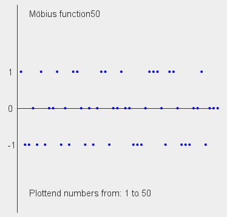

# JavaMath

This is program for some math function created by me. They are not exactly efficient, they are just for education purposses.

## Structure of files

"*src /* ***App.java***" - function are called from this program. There are some examples, which you can un-comment to acces. All math functions are located in "*src/lib/java/math*". There are also constants, which are declared by approximation, and they are located in "*src/lib/java/Constants.java*".

## What function are now working?

- **Prime omega functions** ("*src/lib/java/math/functions/prime_omega_function.java*") - They are counting number of prime factors of natural number n. Lowercase omega function *ω(n)* returns amount of unigue factors and uppercase omge function *Ω(n)* returns number of all factors. You can read more on wikipedia: *https://en.wikipedia.org/wiki/Prime_omega_function#Example_I:_A_modified_summatory_function*.
- **Liouville function** ("*src/lib/math/functions/liouville_function.java*") - Returns *-1* or *+1* depending on output of *Ω(n)*. You can read more on wikipedia: *https://en.wikipedia.org/wiki/Liouville_function*.
- **Kronecker function** ("*src/lib/math/functions/kronecker_delta.java*") - Returns *0* or *+1* depending if number *i* is or isn't equal to number *j*. You can read more on wikipedia: *https://en.wikipedia.org/wiki/Kronecker_delta*.
- **Möbius function** ("*src/lib/math/functions/mobius_function.java*") - Return *0*, *-1* or *+1* depending if number is prime, number has squared prime factor or even number of prime factors. You can read more on wikipedia: *https://en.wikipedia.org/wiki/Möbius_function*.

## What function you can plot?
- **Möbius function** - You can plot values of Möbius function *μ(n)* from 1 to 50. With some editting you can add more values, but it will become really messy.  

- test