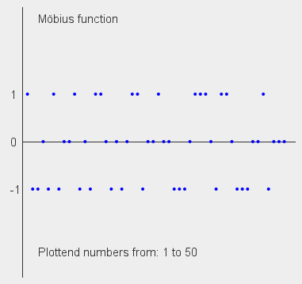
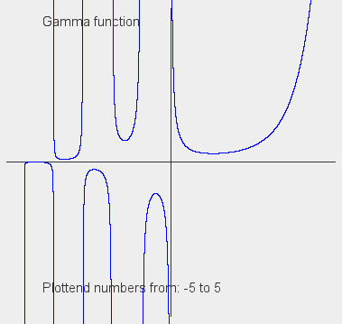

# **JavaMath**

This is program for some math function created by me. They are not exactly efficient, they are just for education purposses.

## **Structure of files**

- "***src/App.java***" - function are called from this file. There are some examples, which you can un-comment to acces. All math functions are located in "*src/lib/java/math*". 
- "***src/lib/java/math/functions***" - place where all my math function are located.
- "***src/lib/java/math/plotter***" - place where all my plots are located.
- "***src/lib/java/constants***" - place where some constants, declared by my self or created by functions, are located.

## **What function are now working?**

- **Prime omega functions** ("*src/lib/java/math/functions/prime_omega_function.java*") - They are counting number of prime factors of natural number n. Lowercase omega function *ω(n)* returns amount of unigue factors and uppercase omge function *Ω(n)* returns number of all factors. You can read more on wikipedia: *https://en.wikipedia.org/wiki/Prime_omega_function*.
- **Liouville function** ("*src/lib/java/math/functions/liouville_function.java*") - Returns *-1* or *+1* depending on output of *Ω(n)*. You can read more on wikipedia: *https://en.wikipedia.org/wiki/Liouville_function*.
- **Kronecker function** ("*src/lib/java/math/functions/kronecker_delta.java*") - Returns *0* or *+1* depending if number *i* is or isn't equal to number *j*. You can read more on wikipedia: *https://en.wikipedia.org/wiki/Kronecker_delta*.
- **Möbius function** ("*src/lib/java/math/functions/mobius_function.java*") - Return *0*, *-1* or *+1* depending if number is prime, number has squared prime factor or even number of prime factors. You can read more on wikipedia: *https://en.wikipedia.org/wiki/Möbius_function*.
- **Gamma function** ("*src/lib/java/math/functions/gamma_function.java*") - Extension of the factorial function. Output of Gamma function *Γ(z)* is only Lanczos approximation. You can read more on wikipedia: *https://en.wikipedia.org/wiki/Gamma_function*; *https://en.wikipedia.org/wiki/Lanczos_approximation*.
- **Riemann zeta function** ("*src/lib/java/math/functions/riemann_zeta_function*") - Algoritm for well-known Euler-Riemann zeta function. Input works only for real numbers higher than *1*. You can read more on wikipedia: *https://en.wikipedia.org/wiki/Riemann_zeta_function*.

## What function you can plot?
- **Möbius function** - You can plot values of Möbius function *μ(n)* from *1* to *50*. With some editing you can add more values, but it will become really messy.  

- **Gamma function** - You can plot values of Gamma function *Γ(z)* from *-5* to *5*. WIth some editing you can expand to more values, but it will again become really messy.  
