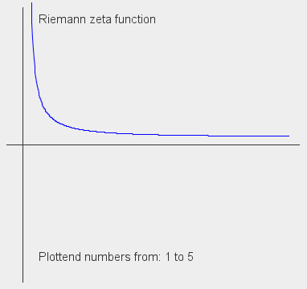
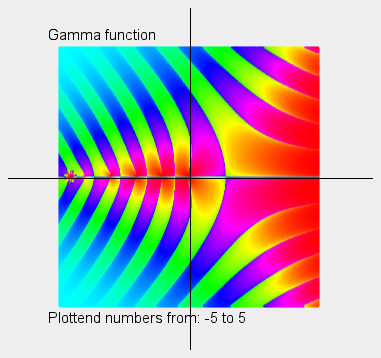
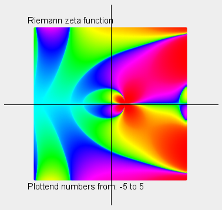

# **JavaMath**

This is program for some math function created by me. They are not exactly efficient, they are just for education purposses.

## **Structure of files**

- "***src/App.java***" - function are called from this file. There are some examples, which you can un-comment to acces. All math functions are located in "*src/lib/java/math*". 
- "***src/lib/java/math/functions/***" - place where all my math function are located.
- "***src/lib/java/math/plotter/***" - place where all my plots are located.
- "***src/lib/java/constants/***" - place where some constants, declared by my self or created by functions, are located.
- "***src/lib/math/complex/***" - place where all files and folder of complex mathematics are located.
- "***img/***" - place where all additional images are located.
# **Functions which are based on real numbers**
## **What function are now working?**

- **Sign function** ("*src/lib/java/math/function/sign_function.java*") - Simple function that returns *-1* is number *x* is lower than *0*, returns *0* if *x* is equal to *0* and returns *1* if *x* is larger than *0*. You can read more on wikipedia: *https://en.wikipedia.org/wiki/Sign_function*.
- **Prime omega functions** ("*src/lib/java/math/functions/prime_omega_function.java*") - They are counting number of prime factors of natural number n. Lowercase omega function *ω(n)* returns amount of unigue factors and uppercase omge function *Ω(n)* returns number of all factors. You can read more on wikipedia: *https://en.wikipedia.org/wiki/Prime_omega_function*.
- **Liouville function** ("*src/lib/java/math/functions/liouville_function.java*") - Returns *-1* or *+1* depending on output of *Ω(n)*. You can read more on wikipedia: *https://en.wikipedia.org/wiki/Liouville_function*.
- **Kronecker function** ("*src/lib/java/math/functions/kronecker_delta.java*") - Returns *0* or *+1* depending if number *i* is or isn't equal to number *j*. You can read more on wikipedia: *https://en.wikipedia.org/wiki/Kronecker_delta*.
- **Möbius function** ("*src/lib/java/math/functions/mobius_function.java*") - Return *0*, *-1* or *+1* depending if number is prime, number has squared prime factor or even number of prime factors. You can read more on wikipedia: *https://en.wikipedia.org/wiki/Möbius_function*.
- **Gamma function** ("*src/lib/java/math/functions/gamma_function.java*") - Extension of the factorial function. Output of Gamma function *Γ(z)* is only Lanczos approximation. You can read more on wikipedia: *https://en.wikipedia.org/wiki/Gamma_function*; *https://en.wikipedia.org/wiki/Lanczos_approximation*.
- **Riemann zeta function** ("*src/lib/java/math/functions/riemann_zeta_function*") - Algoritm for well-known Euler-Riemann zeta function. Input works only for real numbers higher than *1*. You can read more on wikipedia: *https://en.wikipedia.org/wiki/Riemann_zeta_function*.

## **What function you can plot?**
- **Möbius function** ("*src/lib/java/math/plotter/function_plotter/mobius_plotter.java*") - You can plot values of Möbius function *μ(n)* from *1* to *50*. With some editing you can add more values, but it will become really messy.  

- **Gamma function** ("*src/lib/java/math/plotter/function_plotter/gamma_plotter.java*") - You can plot values of Gamma function *Γ(z)* from *-5* to *5*. WIth some editing you can expand to more values, but it will again become really messy.  

- **Riemann zeta function** ("*src/lib/java/math/plotter/function_plotter/zeta_plotter.java*") - You can plot values of Riemann zeta function from *-1* to *5*. You can ho higher than *5* but lower that *-1* it wont work. Also, my algorithm is very slow, so it outputs some inaccurate answers to become more faster.  
<!--  -->
# **Complex numbers and functions**
## **What complex operations it can perform?**

- Nearly all my knowledge about complex numbers and their operations is taken from wikipedia: *https://en.wikipedia.org/wiki/Complex_number*.
- My algorithms for complex numbers currently supports:
  - **Addition & Subtraction**
  - **Multiplicaton & Division**
  - **Square & Square root**
  - **Exponential function**
  - **Natural logarithm**
  - **Sin & cosin**
  - **Arctan**
  - **Exponentiation**
  - **Mod**

## **What complex functions are now working?**

- **Gamma function** ("*src/lib/java/math/complex/functions/complex_gamma_function.java*") - Extension of gamma function to all complex numbers. Again you can read more on wikipedia: *https://en.wikipedia.org/wiki/Gamma_function*. I used the same approximation, just modified for complex numbers, as for gamma function for real numbers: *https://en.wikipedia.org/wiki/Lanczos_approximation*.
- **Riemann zeta function** ("*src/lib/java/math/complex/function/complex_zeta_function.java*") - Extension of zeta function ti all complex numbers except *1*. This is done thanks to Abel-Plana formula: *https://en.wikipedia.org/wiki/Abel–Plana_formula*, and integral is solved with Composite Simpson's Rule *https://en.wikipedia.org/wiki/Adaptive_quadrature*. You can read more again on wikipedia: *https://en.wikipedia.org/wiki/Riemann_zeta_function*.

## **What complex function can it plot?**

- **Gamma function** ("*src/lib/java/math/plotter/complex_function_plotter/complex_gamma_plotter.java*") - Plotted thanks to domain coloring: *https://en.wikipedia.org/wiki/Domain_coloring*. Color is assained to product of real and imaginary output from gamma function. Its not exactly precise, but it do it's job. You can choose between printing 22k, 90k or 360k points, this picture is printed with 360k points 
 
- **Zeta function** ("*src/lib/java/math/plotter/complex_function_plotter/complex_gamma_plotter.java*") - Plotter again thanks to domain coloring. All properities stay the same as for *Gamma function*. Its not presize with big numbers, its just approximation for smaller numbers. You can choose to plot 5.5k, 20k, 90k, 360k points, which takes something about 10 minuts to print. This picture is prited with 360k points. 
